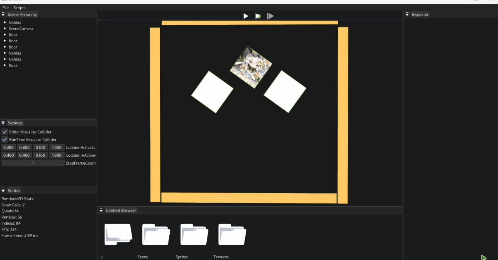

# Engine_Tutorial
Learning GameEngine with The Cherno in Youtobe  
>clone this with:  
>git clone --recursive https://github.com/zjypls/Engine_Tutorial.git
>
Learning:  
>The Cherno's GameEngine Series  
>https://www.youtube.com/playlist?list=PLlrATfBNZ98dC-V-N3m0Go4deliWHPFwT  
>
  
## Screen Shot:
Editor:

notices:can build with msvc or clang(must off ReBuildScriptsCore flags in CMakeLists.txt)
